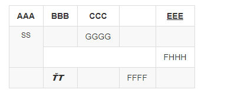

# 表格

注： : 代表对齐方式 ,** : 与 | 之间不要有空格**，否则对齐会有些不兼容。

1、复杂写法

代码：

    |a|b|c|
    |:------:|:------|------:|
    |居中|居左|居右|
    |======|======|======|

演示：

|a|b|c|
|:------:|:------|------:|
|居中|居左|居右|
|======|======|======|

2、简约写法

代码：

    a|b|c
    :-:|:-|-:
    居中|居左|居右
    ======|======|======

演示：

a|b|c
:-:|:-|-:
居中|居左|居右
======|======|======

3、特殊表格

一般对合并单元格，以及其他特殊格式表格，markdown 是无能为力的，
所以常规的做法是使用HTML标签，但是这样的编写效率极低。
但是有了这款工具的话，所有问题都迎刃而解。

在线生成HTML代码 [Tables Generator](http://www.tablesgenerator.com/) (国外的站)

图片展示：

