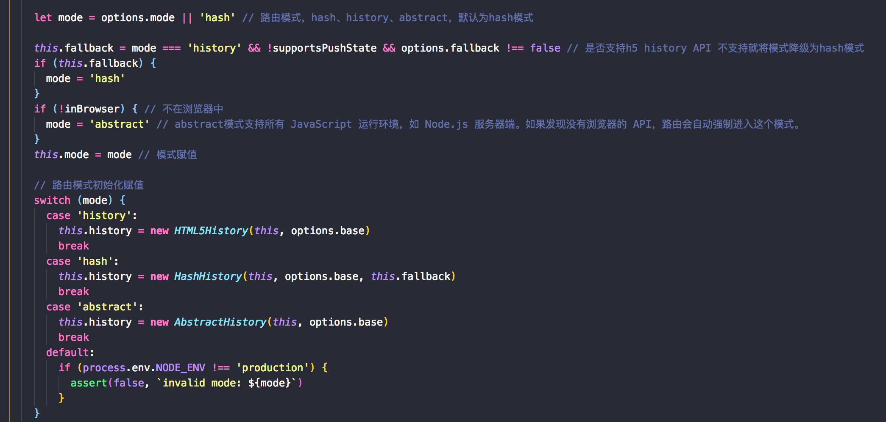

<!--
 * @Author: jackson
 * @Date: 2019-08-19 21:34:18
 * @LastEditors: jackson
 * @LastEditTime: 2019-10-22 18:15:13
 -->

# vue-router源码解读

该小节主要介绍vue-router（目录结构自行研究）源码从打包构建到各api底层实现的粗略解读，如有解读不对的地方欢迎在issue中评论[issues](https://github.com/zhangjunlin6666/study-summary/issues),当然在读本教程前，需要读者熟悉vue-router的基本用法，且有一定的项目开发经验，这样能更好的理解源码实现。同时附上vue-router官网以及相关周边

[vue-router官网](https://router.vuejs.org/zh/)

[package.json文件详解](https://www.cnblogs.com/tzyy/p/5193811.html)

[vuePress文档生成器](https://vuepress.docschina.org/)

[terser](https://www.npmjs.com/package/terser)

[rollup](https://www.rollupjs.com)

## 源码解读步骤

我们在看第三方包或者框架源码时，往往不知道从何下手，不知道流程，但从平时开发SPA项目应该能知道，我们的应用程序都会有一个入口文件，对于框架而言，它也有自己的入口文件，那么观看源码的第一步就是要找到这个入口文件，怎么找呢？平时进行业务开发时，我们都会在项目根目录中见到一个package.json的文件，我们在本地开发运行的诸如npm run dev、npm run build等等命令就是在该文件的scripts字段中定义的，而scripts字段的值往往就包含我们应用程序的入口文件，因此我们在看vue-router或者其他框架源码时，也是找到该文件查看scripts字段，而那个字段是的呢？通常应用程序上线打包都是build字段，所以我们首先找到build字段查看，根据build字段的值找到我们的打包入口文件，以vue-router的package.json为例：


<b>dev</b>：运行npm run dev会在本地起一个本地服务，用于vue-router官方列子展示，在server.js中会利用webpack进行打包，利用express起一个静态服务器用于例子的访问。

<b>dev:dist</b>: 打包构建用于开发环境下的vue-router文件，未压缩

<b>build</b>：打包构建所有环境以及目标的vue-router文件，该字段即是vue-router的打包入口文件

后面的一些脚本大多是用于eslint校验、静态语法检查、单元测试以及文档生成的脚本，有兴趣的可自行去研究，最后一个脚本release是运行一个shell脚本，该脚本用于将代码提交至vue-router github仓库以及发布至npm平台的。在发布前会运行npm run test进行一系列的验证、单元测试脚本运行，以确保代码的质量。

## vue-router打包配置文件

### 打包入口文件build.js

在该文件中会引入几个node内置模块<b>fs、path、zlib</b>，以及第三方模块<b>terser</b>、打包工具<b>rollup</b>、入口配置文件<b>config</b>，待会儿后面再说config的具体内容。

首先会利用<b>fs.existsSync('dist')</b>检查项目根目录下有没有dist目录，如果没有就创建，该目录是存放打包好后的vue-router文件。之后会执行<b>build</b>方法进行打包。

build方法需要接收一个配置数组为参数，在build方法内部递归调用<b>next</b>方法，当打包的次数大于配置数组长度时，结束递归。next方法中调用<b>buildEntry</b>方法，该方法接收一个
配置对象，该对象包括<b>input和output</b>字段，在buildEntry中首先检查需要生成的文件是否需要压缩，通过后缀<font color=red>.min</font>来确认，在buildEntry的内部，会调用<b>rollup.rollup</b>方法添加入口，并在成功会调用中调用<b>write</b>方法，如果需要压缩（gzip压缩，具体可查询node的内置模块zlib）就给write方法传入第三个参数，表示是否需要压缩，write方法的第一个参数是出口文件的文件名称，第二个参数是入口代码，在write方法内部通过<b>fs.writeFile</b>方法异步的往输出文件中写入打包压缩（如果启用压缩的话）后的内容。至此build.js文件便大概的分析完成，下面再来看看config.js中做了什么。

### config.js输出打包配置数组

该文件中引入了node内置模块path，然后一些rollup的第三方插件，具体可自行[百度](https://www.baidu.com)或[谷歌](https://www.google.com/)，然后引入了package.json，该引入只是取版本号而已如果没有传入版本号的话，用于打包时在终端输出版本号。resolve该方法是用于路径的解析。

该文件只是导出一个配置数组，在初始化的数组对象中定义配置的输出路径、环境以及打包目标，然后通过数组的map方法进行处理返回一个处理后的配置数组。

在map方法中接收了一个<b>genConfig</b>方法，该方法接收初始的配置对象作为参数，并返回带有<b>input和output</b>字段的配置对象，然后通过初始条件按需添加插件配置，但最重要的是添加入口文件，即<b color=red>resolve('src/index.js')</b>，至此我们才真正的找到了vue-router的入口文件。接下来将是我们真正的源码之旅，上面只是简单的打包过程介绍。

## vue-router源码

vue-router做了很好的分层（一种代码架构模式），例如在scr目录下，components目录放了两个全局组件router-view和router-link，history存放的是各个模式下实现的路由方法，它们均继承自base.js，util中存放的是各种工具函数！鉴于本人水平有限，其中细节无法分析透彻！如有兴趣可自行阅读详细源码实现！

我们在用vue-router时，因它是vue的一个插件，所以直接通过vue.use(vueRouter)（vue.use底层原理可自行查阅资料或观看源码，本文档后期也会做相关说明）的方式进行注册，而根据vue官网介绍use方法需要传递一个函数或者一个带有install字段并且value为函数的对象作为参数，根据该说明，在我们使用`import VueRouter from 'vue-router'`引入路由时，就能猜想到，在VueRouter这个类上有一个静态方法install，事实上确实是这样的。接下来我们首先来分析VueRouter.install方法做了些什么。

### 插件注册文件 install.js 路径 ===>>> /src/install.js 该install主要做了以下事情：

1、在vue原型上挂载$router、$route属性


2、注册两个全局组件router-link、router-view(router-view的无限嵌套是在组件内部去实现的，并且该组件是一个函数式组件，关于函数式组件可自行查看官网说明)

3、利用vue.mixin()方法初始化vue-router框架中需要用到的一些变量以及初始化路由，例如：_routerRoot、_router、_route


图中的Vue.util.defineReactive(this, '_route', this._router.history.current) 意思是让当前组件实例上的_route属性变成响应式的，在vue-router内部会根据_route的变化动态更新当前路由对应的组件，从而实现跳转路由页面更新的效果，所以vue-router只能应用在vue中，因为它强绑定了vue

Vue.util.defineReactive方法是vue提供的一种响应式数据的方式！

该文件导出的install方法中，首先会判断是否注册过vue-router，若注册过就跳过后续程序执行。

### 入口文件 index.js 路径 ===>>> /src/index.js

该文件默认导出vueRouter构造函数，并挂载install属性，将vueRouter传递给vue.use方法可进行插件的注册，在vue.use方法内部会去调用install方法。

在vueRouter的构造器中，通过选项参数options的mode字段来确认当前路由采用哪种路由模式，默认为hash模式



vue-router针对几种模式定义了对应模式的方法（例如：push、go、replace、resolve、addroutes、getMatchedComponents以及钩子函数beforeEach、afterEach、beforeResolve，事件onError、onReady。）以及路由初始化方法init，该方法（init）在install的vue.mixin中调用，并传入当前vue实例！

hash模式是基于onchangehash以及window.location.hash实现的，[hash](https://developer.mozilla.org/zh-CN/docs/Web/API/Window/onhashchange)

history模式是基于h5的history API实现的，[history](https://developer.mozilla.org/zh-CN/docs/Web/API/History_API)


至此vue-router大致的分析就到此结束，自我感觉分析比较粗糙，无奈水平有限！最后附上简易vue-router源码实现！

``` javascript
/**
 * 理解vue-router实现原理，需要做的事情
 * 插件的实现
 * url变化监听
 * 路由配置解析
 * 实现全局组件：router-link，router-view
 */
let _Vue;
class VueRouter {
    // 实例化router的时候传递的配置选项
    constructor (options) {
        this.options = options;
        this.routeMap = {};

        // 利用vue响应式来实现路由响应式，与vue强绑定，只能用在vue中
        this.app = new _Vue({
            data () {
                return {
                    current: '/'
                };
            }
        });
    }

    init () {
        this.bindEvents(); // 监听url变化
        this.createRouteMap(this.options); // 解析路由配置
        this.initComponent(); // 实现两个组件router-view router-link
    }

    bindEvents () {
        // 页面加载完执行，通过bind改变this指向
        window.addEventListener('load', this.onHashChange.bind(this));
        // hash变化时执行
        window.addEventListener('hashchange', this.onHashChange.bind(this));
    }

    onHashChange () {
        this.app.current = window.location.hash.slice(1) || '/';
    }

    // 生成路由映射表
    createRouteMap (options) {
        options.routes.forEach(item => {
            this.routeMap[item.path] = item.component;
        });
    }

    // 实现router-view、router-link组件
    initComponent () {
        _Vue.component('krouter-link', {
            props: {
                to: String
            },
            render (h) {
                return h('a', {
                    attrs: {
                        href: '#' + this.to
                    }
                }, [
                    this.$slots.default
                ]);
            }
        });

        _Vue.component('krouter-view', {
            // 利用箭头函数将使得render函数中的this指向VueRouter实例
            render: (h) => {
                const comp = this.routeMap[this.app.current];
                return h(comp);
            }
        });
    }
}
VueRouter.install = function (Vue) {
    _Vue = Vue;
    //  混入
    Vue.mixin({
        beforeCreate () {
            // console.log(this);
            // this是vue实例
            if (this.$options.KRouter) {
                // 仅在根组件执行一次
                Vue.prototype.$krouter = this.$options.KRouter;
                this.$options.KRouter.init();
            }
        }
    });
};

export default VueRouter;

```
