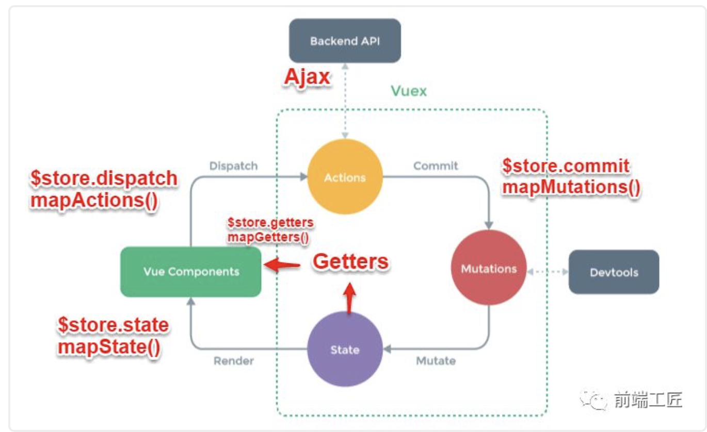

# 组件化

组件是可复用的 Vue 实例，且带有一个名字！我们的页面都是由一个元素一个元素组成的，而元素的组合可以形成我们所需要的组件，所以对于一个项目我们可以将其
拆分为一个个的组件，比如基础组件、业务组件、布局组件等，这么做的目的是为了提高代码的复用性、可维护性以及扩展性，最主要的是可以提高我们的工作效率、减
少出错、快速定位问题！而组件的编写需要考虑的是：组件之间的通信、某些逻辑代码的复用、组件的扩展等！下面将介绍组件扩展的方式、通信以及代码复用的问题！

## 组件扩展之slot

插槽的使用，slot属性可为我们的组件扩展结构，所谓插槽通俗点来讲就好比我们的组件是一台电脑，而我们的插槽就相当于电脑中的内存扩展槽，这样我们的电脑就得到了扩展，增加了内存！而对于vue的slot来说是扩展了组件的结构。

在 2.6.0 中，我们为具名插槽和作用域插槽引入了一个新的统一的语法 (即 v-slot 指令)。它取代了 slot 和 slot-scope 这两个目前已被废弃但未被移除且仍在文档中的特性。

### slot和slot-scope(在2.6.0以后弃用)用法以及slot和v-slot用法

#### 默认插槽

```html
<!-- 子组件 -->
<template>
    <div>
        <button>
            <!-- 此处为slot的默认内容(也称为后备内容)，如果在父组件中应用该组件时没有传入slot内容，
                那么button的value为submit，如果传入了内容，则会替换默认内容显示传入的内容
             -->
            <slot>submit</slot>
        </button>
    </div>
</template>

<!-- 父组件 -->
<template>
    <div>
        <!-- 这里传入了slot，button的value为reset -->
        <cButton>{{value}}</cButton>
    </div>
</template>
<script>
import cButton from "cButton.vue";
export default {
    data () {
        return {
            value:'reset'
        }
    },
    components:{
        cButton
    }
}
</script>
```

#### 具名插槽

```html
<!-- 子组件 -->
<template>
    <div>
        <div>
            <!-- 所谓具名插槽，就是给我们的插槽取一个名字，这样可以对组件进行多方位的扩展-->
            <slot></slot>
            <slot name='hasName'></slot>
        </div>
    </div>
</template>

<!-- 父组件 -->
<template>
    <div>
        <!-- 2.6.0之前的写法，给组件中的元素定义slot属性，值为子组件中的name值 -->
        <cDiv>
            <span>{{noName}}</span>
            <span slot='hasName'>{{hasName}}</span>
        </cDiv>
        <!-- 2.6.0之后的写法，一个不带name的slot，出口会带有隐含的名字default，也可
            不写v-slot:default，如果不写slot那么所有没有v-slot的元素都会被视为默认
            插槽的内容。

            在向具名插槽提供内容的时候，我们可以在一个元素上使用v-slot指令，
            并以v-slot的参数的形式提供其名称

            注意 v-slot 只能添加在一个 <template> 上，只有一种例外情况即独占默认插槽的缩写语法
        -->
        <cDiv>
            <template v-slot:default>{{noName}}</template>
            <template v-slot:hasName>{{hasName}}</template>
        </cDiv>
    </div>
</template>
<script>
import cDiv from "cDiv.vue";
export default {
    data () {
        return {
            noName:'我是默认插槽',
            hasName:'我是具名插槽'
        }
    },
    components:{
        cDiv
    }
}
</script>
```

#### 作用域插槽

有时让插槽内容能够访问子组件中才有的数据是很有用的，绑定在 `<slot>` 元素上的特性被称为插槽 prop。现在在父级作用域中，我们可以给 v-slot 带一个值来定义我们提供的插槽 prop 的名字

```html
<!-- 子组件 -->
<template>
    <div>
        <div>
            <!-- 可以把data作为slot的一个特性将组件中的数据传递出去 -->
            <slot :data='scope'></slot>
        </div>
    </div>
</template>
<script>
export default {
    data() {
        return {
            scope:"我是通过作用域插槽传递的数据"
        }
    }
}
</script>
<!-- 父组件 -->
<template>
    <div>
        <!-- 2.6.0之前的写法 -->
        <cDiv>
            <span slot-scope='slotScope'>{{slotScope.scope}}</span>
        </cDiv>
        <!-- 2.6.0之后的写法-->
        <cDiv>
            <template v-slot:default='slotScope'>{{slotScope.scope}}</template>
        </cDiv>
        <!-- 当然我们可以利用es6解构插槽来简化我们的写法，也可以进行重命名和定义默认值 -->
        <cDiv>
            <template v-slot:default='{scope}'>{{scope}}</template>
        </cDiv>
        <!-- 我们的具名插槽还可以通过缩写来简化写法，跟v-on和v-bind一样，v-slot也有缩写
            即把参数之前的所有内容(v-slot:)替换为字符#，该缩写只在其有参数的时候才可用。
            下面这种写法是无效的，这样会触发一个警告
            <cDiv>
                <template #='{scope}'>{{scope}}</template>
            </cDiv>
        -->
        <cDiv>
            <template #default='{scope}'>{{scope}}</template>
        </cDiv>
    </div>
</template>
<script>
import cDiv from "cDiv.vue";
export default {
    components:{
        cDiv
    }
}
</script>
```

## 代码复用之extends和mixins

### mixins

混入 (mixin) 提供了一种非常灵活的方式，来分发 Vue 组件中的可复用功能。一个混入对象可以包含任意组件选项。当组件使用混入对象时，所有混入对象的选项将被“混合”进入该组件本身的选项。具体混入规则可参考vue官网：[mixins](https://cn.vuejs.org/v2/guide/mixins.html)

```javascript
// mixin中钩子会比当前组件实例的钩子优先执行，我们可以将公共的逻辑封装在mixin中
var mixin = {
  created: function () { console.log(1) }
}
var vm = new Vue({
  created: function () { console.log(2) },
  mixins: [mixin]
})
// => 1
// => 2
```

### extends

允许声明扩展当前组件，通过extends继承基础组件进行扩展。

这和 mixins 类似。区别是传递参数不同，mixins是一个选项对象数组，extends是一个选项对象或构造函数，以及extends优先级高于mixins。

extends的合并规则与mixins类似，要么做合并要么以组件数据、选项为主。例如在data、methods、components、directives等选项中有对象
键名冲突时，组件选项会替换extends中的选项，因此我们可以对extends中的部分选项进行重写。

#### 代码演示(假设在同一目录下)：

```html
<!-- BaseComponent 用于继承的基础组件，可将全局选项封装在此组件中 -->
<script>
export default {
    data() {
        return {
            commonData:"我是公共数据"
        }
    },
    created(){
        console.log("我是继承来的生命周期函数")
    },
    methods:{
        commonMethod(){
            console.log("我是公共方法")
        },
        DuplicateNameMethod(){
            console.log("我是BaseComponent中的重名方法")
        }
    }
}
</script>

<!-- 需要继承BaseComponent的组件 -->
<template>
    <div>
        <button @click='commonMethod'>{{commonData}}</button>
        <button @click='comMethod'>{{comData}}</button>
    </div>
</template>
<script>
import BaseComponent from "./BaseComponent";
export default {
    extends:BaseComponent, // 这里会将BaseComponent中的选项继承下来，
    data() {
        return {
            comData:"我是组件数据"
        }
    },
    created(){
        // 生命周期在执行时，会先执行basecomponent，再执行组件自身的钩子函数
        console.log("我是组件的生命周期函数")
    },
    methods:{
        commonMethod(){
            console.log("我是组件方法")
        },
        /* 在组件和BaseComponent中都有一个DuplicateNameMethod方法，实际上组件中的
            DuplicateNameMethod方法会替换BaseComponent中的DuplicateNameMethod
            方法，最终打印的会是“我是组件中的重名方法”
        */
        DuplicateNameMethod(){
            console.log("我是组件中的重名方法")
        }
    }
}
</script>
```

## 下面将介绍几种组件通信的方式。

## 第一种父组件与自组件通信 ———— props

props是在子组件中定义的一个选项，可将父组件中的数据通过定义的props传递到子组件中，它拥有的类型如下所示：

``` javascript
Vue.component('my-component', {
  props: {
    // 基础的类型检查 (`null` 和 `undefined` 会通过任何类型验证)
    propA: Number,
    // 多个可能的类型
    propB: [String, Number],
    // 必填的字符串
    propC: {
      type: String,
      required: true
    },
    // 带有默认值的数字
    propD: {
      type: Number,
      default: 100
    },
    // 带有默认值的对象
    propE: {
      type: Object,
      // 对象或数组默认值必须从一个工厂函数获取
      default: function () {
        return { message: 'hello' }
      }
    },
    // 自定义验证函数
    propF: {
      validator: function (value) {
        // 这个值必须匹配下列字符串中的一个
        return ['success', 'warning', 'danger'].indexOf(value) !== -1
      }
    }
  }
})
```

### 代码演示(假设在同一目录下)：

子组件定义：

``` html
<template>
    <ul>
        <li v-for='item in list'>{{item}}</li>
    </ul>
</template>
<script>
    export default {
        props:{
            list:{
                type:Array,
                require:true,
                default(){
                    return []
                }
            }
        }
    }
</script>
```

父组件应用：

``` html
<template>
    <div>
        <todo-list :list='list'></todo-list>
    </div>
</template>
<script>
    import todoList from './todoList.vue'
    export default {
        data() {
            return {
                list: [1,2,3,4]
            }
        },
        components:{
            todoList
        }
    }
</script>
```

## 第二种子组件与父组件通信 ———— $emit

子组件与父组件通信是通过在子组件中使用$emit触发某个事件并传递参数（根据需要可传可不传），并在父组件中通过指令v-on:eventname（或者@:eventname）绑定事件并接受参数来实现的。

### 代码演示(假设在同一目录下)：

子组件定义：

``` html
<template>
    <div>
        <button @click='clickMe'>clickme</button>
    </div>
</template>
<script>
    export default {
        methods:{
            clickMe(){
                this.$emit('clickMe','我是从子组件c-button传递过来的')
            }
        }
    }
</script>
```

父组件应用：

``` html
<template>
    <div>
        <v-button @clickMe='onClick'></v-button>
    </div>
</template>
<script>
    import vButton from './vButton.vue'
    export default {
        components:{
            vButton
        },
        methods:{
            onClick(fromSon){
                console.log(fromSon);
            }
        }
    }
</script>
```

## 第三种provide与inject实现通信

这对选项需要一起使用，以允许一个祖先组件向其所有子孙后代注入一个依赖，不论组件层次有多深，并在起上下游关系成立的时间里始终生效。

在有些情况下需要根组件与多级子组件共享数据，如果使用props进行组件直接传值会相当麻烦，此时可以通过在父组件中定义provide选项定义需要共享的数据，在子组件中通过inject注入数据，这样就可以拿到父级组件共享的数据！但provide中共享的数据不是响应式的，如果需要做响应式，可以使用2.6最新API Vue.observable 优化响应式 provide(推荐)

provide可以是对象也可以是返回对象的函数，inject可以是一个字符串数组或者对象。

### 代码演示(假设在同一目录下)：

子组件定义：

``` html
<template>
    <div>
        <button @click='clickMe'>clickme</button>
    </div>
</template>
<script>
    export default {
        inject:['a'],
        methods:{
            clickMe(){
                console.log(this.a);
            }
        }
    }
</script>
```

父组件应用：

``` html
<template>
    <div>
        <v-button></v-button>
    </div>
</template>
<script>
    import vButton from './vButton.vue'
    export default {
        provide:{
            return {
                a:'我是通过provide向子组件传递的值'
            }
        },
        components:{
            vButton
        }
    }
</script>
```

## 第四种使用$attrs和$listeners实现通信

    官网描述：

    $attrs是指包含了父作用域中不作为 prop 被识别 (且获取) 的特性绑定 (class 和 style 除外)。
    当一个组件没有声明任何 prop 时，这里会包含所有父作用域的绑定 (class 和 style 除外)，
    并且可以通过 v-bind="$attrs" 传入内部组件——在创建高级别的组件时非常有用

    $listeners是指包含了父作用域中的 (不含 .native 修饰器的) v-on 事件监听器。
    它可以通过 v-on="$listeners" 传入内部组件——在创建更高层次的组件时非常有用。

    这里意思是$attrs表示的是子组件所有的非props属性，在子组件中可通过this.$attrs获取。

    默认情况下$attrs中的属性都是添加在子组件的包裹元素上，可以通过在子组件中设置选项inheritAttrs
    的值为false，可以取消该默认行为。

    $listeners是指绑定在子组件上所有的事件，在子组件中可通过this.$listeners获取。

    有时候在父作用域中给子组件添加事件，会发现添加的事件不生效，比如click事件，要想使事件能执行，
    需要在子组件中触发click事件，如果不触发事件，咱们也可通过修饰符达到该效果。通过修饰符添加的
    事件是绑定在子组件的根元素上的。

### 代码演示(假设在同一目录下)：

子组件定义：

``` html
<template>
    <div>
        <button 
            v-bind='$attrs' 
            v-on='$listeners'>clickme</button>
    </div>
</template>
<script>
    export default {
        created(){
            console.log(this.$attrs) // 打印 { a:'a', b:'b', c:'c'}
            console.log(this.$listeners) // 打印 { a: 'clicka', b: 'clickb', c:'clickc'}
        }
    }
</script>
```

父组件应用：

``` html
<template>
    <div>
        <v-button 
            a='a' 
            b='b' 
            c='c' 
            @a='clicka' 
            @b='clickc' 
            @c='clickc'
            @click.native='clickNative'></v-button>
    </div>
</template>
<script>
    import vButton from './vButton.vue'
    export default {
        methods:{
            clicka(){
                console.log('a')
            },
            clickb(){
                console.log('b')
            },
            clickc(){
                console.log('c')
            }
        },
        components:{
            vButton
        }
    }
</script>
```

## 第五种使用事件总线机制实现通信

该种方式可以实现父子组件间、兄弟组件之间相互通信，但项目数据共享过于复杂不太适合使用事件总线机制。

所谓事件总线机制无非就是通过实例化一个vue实例，将该vue实例作为一个中转站来进行通信，具体是通过vue
实例的$emit以及$on方法来实现的。

### 代码演示(假设在同一目录下)：

Vue项目中的main.js部分代码

``` javascript
import Vue from 'vue';
let bus = new Vue();
Vue.prototype.$bus = bus;


```

子组件A定义：

``` html
<template>
    <div>
        <button @click='sendData'>clickme</button>
    </div>
</template>
<script>
    export default {
        data() {
            return {
                a:''
            }
        },
        methods:{
            sendData(){
                this.$bus.$emit('fromA','我是来自a组件的数据')
            }
        },
        mounted(){
            this.$bus.$on('fromParent',res => {
                this.a = res; // 会接收来自父组件的数据
            })
        }
    }
</script>
```

子组件B定义：

``` html
<template>
    <div>
        <button>clickme</button>
    </div>
</template>
<script>
    export default {
        data() {
            return {
                B:''
            }
        },
        mounted(){
            this.$bus.$on('fromA',res => {
                this.B = res; // 接受来自A组件的数据，B与A是兄弟组件
            })
        }
    }
</script>
```
父组件应用：

``` html
<template>
    <div>
        <a></a>
        <b></b>
    </div>
</template>
<script>
    import A from './A.vue';
    import B from 'B.vue';
    export default {
        mounted(){
            this.$bus.$emit('fromParent','我是来自父组件的数据')
        },
        components:{
            A,B
        }
    }
</script>
```

## 第六种方式发布订阅者模式进行通信

所谓发布订阅者其实是程序设计中的一种设计模式，Vue的$on和$emit其本质也是基于这种模式实现的。
该方式也能实现父子组件、兄弟组件之间通信。

### 代码演示(假设在同一目录下)：

Vue项目中的main.js部分代码

``` javascript
import Vue from 'vue';

class Bus {
    constructor(){
        this.callbacks = {};
    }

    $on(name, fn){
        this.callbacks[name] = this.callbacks[name] || [];
        this.callbacks[name].push(fn);
    }

    $emit(name, data){
        if(this.callbacks[name]){
            this.callbacks[name].forEach(fn => {
                fn && fn(data);
            })
        }
    }
}

Vue.prototype.$bus = new Bus();
```

子组件定义：

``` html
<template>
    <div>{{fromBus}}</div>
</template>
<script>
export default {
    data() {
        return {
            fromBus:''
        }
    },
    mounted(){
        this.$bus.$on('fromParent',res => {
            this.fromBus = res; // 接受来自父组件的数据
        })
    }
}
</script>
```

父组件应用：

``` html
<template>
    <div>
        <child></child>
    </div>
</template>
<script>
import child from 'child.vue';
export default {
    mounted(){
        this.$bus.$emit('fromParent','我是来自父组件的数据');
    },
    components:{
        child
    }
}
</script>
```

## 第七种通信方式$children、$parent

常规方式通信（除了事件总线外）是无法做到兄弟组件之间相互通信的，我们可以通过$parent间接实现兄弟组件之间通信。

### 代码演示(假设在同一目录下)：

$parent方式：

子组件A定义：

```html
<template>
    <div>
        我是组件A
    </div>
</template>
<script>
export default {
    mounted(){
        this.$parent.$on('onCompB',(res) => {
            console.log('监听来自组件B的事件并接受参数',res)
        })
        this.$parent.$emit('onCompA', "触发onCompA事件，与B组件通信")
    }
}
</script>
```

子组件B定义：

```html
<template>
    <div>
        我是组件B
    </div>
</template>
<script>
export default {
    mounted(){
        this.$parent.$on('onCompA',(res) => {
            console.log('监听来自组件A的事件并接受参数',res)
        })
        this.$parent.$emit('onCompB', "触发onCompB事件，与A组件通信")
    }
}
</script>
```

父组件定义：

```html
<template>
    <div>
        <A></A>
        <B></B>
    </div>
</template>

<script>
import A from "./A";
import B from "./B";
export default {
    components:{
        A,
        B
    }
}
</script>
```

$parent、$children实现向下或向上单向通信：

首先需要创建一个js文件，如index.js，内容如下：

```javascript
// 由于vue2.0中的$dispatch已废弃，可结合this.$parent自定义$boradcast，向上通知
export function $dispatch (eventName, data) {
    let parent = this.$parent;
    while (parent) {
        parent.$emit(eventName, data);
        parent = parent.$parent;
    }
}

function boradcast (eventName, data) {
    let children = this.$children;
    children.forEach(child => {
        child.$emit(eventName, data);
        if (child.$children.length) {
            boradcast.call(child, eventName, data);
        }
    });
}

// 由于vue2.0中的$broadcast已废弃，可结合this.$children自定义$boradcast，向下广播
export function $boradcast (eventName, data) {
    boradcast.call(this, eventName, data);
}
```

elementui中的$broadcast、$dispatch实现：

在elementui中是通过mixin将$broadcast、$dispatch混合进组件的

``` javascript
function broadcast(componentName, eventName, params) {
    // 遍历当前组件的子组件
  this.$children.forEach(child => {
      // 获取子组件的组件名称
    var name = child.$options.componentName;

    // 判断子组件名称是否与传入的组件名称相等，如果相等就在当前子组件中触发事件
    if (name === componentName) {
      child.$emit.apply(child, [eventName].concat(params));
    } else {
        // 如果不相等，继续递归调用查找子组件的子组件，直到找到传入的组件名为止
      broadcast.apply(child, [componentName, eventName].concat([params]));
    }
  });
}
export default {
  methods: {
    dispatch(componentName, eventName, params) {
    /* 获取当前组件的父组件，如果this.$parent不存在，那说明parent是根组件
        根组件其实是项目中main.js的new Vue()，这个是根组件，
        并且根组件的this.$parent为undefined，而且根组件的this.$root还是根组件自身，
        即this.$root === this 
    */
      var parent = this.$parent || this.$root;
      // 获取父组件的名称
      var name = parent.$options.componentName;

    // 循环判断
    /* 如果parent不存在（即在根组件中），那么终止循环，不触发事件
       如果parent存在且没有componentName属性或者componentName与传入componentName的不相等，
       即当前的parent不是触发事件的目标组件，那么继续循环向上查找parent，直到找到触发事件的目标
       组件为止
    */
      while (parent && (!name || name !== componentName)) {
        parent = parent.$parent;
        // 继续循环如果parent存在，name重新赋值
        if (parent) {
          name = parent.$options.componentName;
        }
      }
      // 如果存在parent就触发事件
      if (parent) {
        parent.$emit.apply(parent, [eventName].concat(params));
      }
    },
    broadcast(componentName, eventName, params) {
      broadcast.call(this, componentName, eventName, params);
    }
  }
};

```

## 第八种终极通信方式vuex



### 1.简要介绍Vuex原理

Vuex实现了一个单向数据流，在全局拥有一个State存放数据，当组件要更改State中的数据时，必须通过Mutation进行，Mutation同时提供了订阅者模式供外部插件调用获取State数据的更新。而当所有异步操作(常见于调用后端接口异步获取更新数据)或批量的同步操作需要走Action，但Action也是无法直接修改State的，还是需要通过Mutation来修改State的数据。最后，根据State的变化，渲染到视图上。

### 2.简要介绍各模块在流程中的功能：

Vue Components：Vue组件。HTML页面上，负责接收用户操作等交互行为，执行dispatch方法触发对应action进行回应。

dispatch：操作行为触发方法，是唯一能执行action的方法。

actions：操作行为处理模块,由组件中的 $store.dispatch('action 名称',data1)来触发。然后由commit()来触发mutation的调用 , 间接更新 state。负责处理Vue Components接收到的所有交互行为。包含同步/异步操作，支持多个同名方法，按照注册的顺序依次触发。向后台API请求的操作就在这个模块中进行，包括触发其他action以及提交mutation的操作。该模块提供了Promise的封装，以支持action的链式触发。

commit：状态改变提交操作方法。对mutation进行提交，是唯一能执行mutation的方法。

mutations：状态改变操作方法，由actions中的 commit('mutation 名称')来触发。是Vuex修改state的唯一推荐方法。该方法只能进行同步操作，且方法名只能全局唯一。操作之中会有一些hook暴露出来，以进行state的监控等。

state：页面状态管理容器对象。集中存储Vue components中data对象的零散数据，全局唯一，以进行统一的状态管理。页面显示所需的数据从该对象中进行读取，利用Vue的细粒度数据响应机制来进行高效的状态更新。

getters：state对象读取方法。图中没有单独列出该模块，应该被包含在了render中，Vue Components通过该方法读取全局state对象。

### 3.vuex持久化缓存之localStorage

vuex 是 vue 的状态管理器，存储的数据是响应式的。但是并不会保存起来，刷新之后就回到了初始状态，具体做法应该在vuex里数据改变的时候把数据拷贝一份保存到localStorage里面，刷新之后，如果localStorage里有保存的数据，取出来再替换store里的state。

## 实际案例

### 代码演示(假设在同一目录下)：

#### $attr、$listeners通信以及slot插槽案例

已我基于elementui的table组件二次封装的表格组件为例，可以通过配置数据列表以及column列的列表达到动态渲染的效果，
类似于iview的列表配置。

```html
<!-- 子组件定义 -->
<template>
    <el-table
        :data="tabelData"
        v-bind='$attrs'
        v-on='$listeners'
        border
        highlight-current-row>
        <!-- 
            $attrs：包含了父作用域中不作为 prop 被识别 (且获取) 的特性绑定 (class 和 style 除外)。当一个组件没有声
            明任何prop 时，这里会包含所有父作用域的绑定 (class 和 style 除外)，并且可以通过 v-bind="$attrs" 传入
            内部组件——在创建高级别的组件时非常有用。

            
            $listeners：包含了父作用域中的 (不含 .native 修饰器的) v-on 事件监听器。它可以通过 v-on="$listeners" 
            传入内部组件——在创建更高层次的组件时非常有用。
        -->
        <el-table-column
            v-if='!!typeItem'
            v-bind="typeItem"
            align="center">
        </el-table-column>
        <!-- 
            这一列是用来判断是否显示拥有type选项的列
         -->
        <el-table-column
            v-for="(item,index) in column"
            :key='index'
            v-bind="item"
            align="center">
            <!-- 作用域插槽的使用 -->
            <template slot-scope="scope">
                <span v-if='!item.slotName'>{{scope.row[item.prop]}}</span>
                <!-- 
                    :scope='scope'为作用域插槽绑定的数据 
                    :name='item.slotName'插槽名称
                -->
                <slot v-else :name='item.slotName' :scope='scope'></slot>
            </template>
        </el-table-column>
    </el-table>
</template>

<script>
export default {
    /* 官网对inheritAttrs选项的解释 */
    /*默认情况下父作用域的不被认作 props 的特性绑定 (attribute bindings) 将会“回退”且作为普通的
      HTML 特性应用在子组件的根元素上。当撰写包裹一个目标元素或另一个组件的组件时，这可能不会总是符合
      预期行为。通过设置inheritAttrs 到 false，这些默认行为将会被去掉。而通过 (同样是 2.4 新增的)
      实例属性 $attrs 可以让这些特性生效，且可以通过 v-bind 显性的绑定到非根元素上。

      注意：这个选项不影响 class 和 style 绑定。*/
    inheritAttrs:false, // 这里在不设置为false的情况下，组件最外层的包裹元素可以不用显示的绑定v-bind=$attr
    props:{
        // 传递给表格的数据
        tabelData:{
            type:Array,
            required:true,
            default(){
                return []
            }
        },

        // 列的配置，兼容elementui上列的所有属性
        column:{
            type:Array,
            required:true,
            default(){
                return []
            }
        },

        // 当列为type（selection/index/expand）类型时的配置,可传递elementui中table-column组件所有的属性
        typeItem:{
            type:Object,
            default(){
                return null
            }
        }
    }
}
</script>

<!-- 父组件应用 -->
<template>
    <c-table :tabelData='tabelData' :column='column' :typeItem='typeItem'>
        <template slot='status' slot-scope="{scope}">
            <!-- 由于在window系统中，gitbook不支持大括号中写三目运算符，使用反斜杠转义大括号即可解决-->
            <span>\{\{scope.row.status === 0 ? "死了" : "活蹦乱跳的"\}\}</span>
        </template>
        <template slot='action' slot-scope="{scope}">
            <el-button text='primary'>删除</el-button>
        </template>
    </c-table>
</template>
<script>
import cTable from "./cTable";
export default {
    components:{ cTable },
    data() {
        return {
            tabelData:[
				{
					name:'张三',
					sex:'男',
					age:30,
					height:178,
					status:1
				},
				{
					name:'李四',
					sex:'男',
					age:78,
					height:170,
					status:0
				},
				{
					name:'如花',
					sex:'女',
					age:23,
					height:172,
					status:1
				}
			],
			column:[
				{
					label:'姓名',
					prop:'name'
				},
				{
					label:'性别',
					prop:'sex'
				},
				{
					label:'年龄',
					prop:'age'
				},
				{
					label:'身高',
					prop:'height'
				},
				{
					label:'状态',
					slotName:'status'
				},
				{
					label:'操作',
					slotName:'action'
				}
			],
			typeItem:{
				type:'selection'
			}
        }
    }
}
</script>
```

#### $parent、$children、provide、inject通信案例

```javascript
/* 基于$parent、$children封装的dispatch和broadcast */
// 由于vue2.0中的$dispatch已废弃，可结合this.$parent自定义$boradcast，向上通知
export function $dispatch (eventName, data) {
    let parent = this.$parent;
    while (parent) {
        parent.$emit(eventName, data);
        parent = parent.$parent;
    }
}

function boradcast (eventName, data) {
    let children = this.$children;
    children.forEach(child => {
        child.$emit(eventName, data);
        if (child.$children.length) {
            boradcast.call(child, eventName, data);
        }
    });
}

// 由于vue2.0中的$broadcast已废弃，可结合this.$children自定义$boradcast，向下广播
export function $boradcast (eventName, data) {
    boradcast.call(this, eventName, data);
}

// 在main.js中将这两个方法挂载到vue的原型上
```

```html
<!-- 简易表单组件 -->

<!-- el-form -->
<template>
    <div class="el_form">
        <slot></slot>
    </div>
</template>

<script>
export default {
    provide(){
        return {
            "elform":this // 注入子孙组件的数据，是子孙组件可访问当前组件
        }
    },
    props:{
        model:{
            type:Object,
            default(){
                return null
            }
        },
        rules:{
            type:Object,
            default(){
                return null
            }
        }
    },
    methods:{
        validate(cb){
            let child = this.$children.filter(v =>v.prop).map(child => child.validate());
            Promise.all(child).then(_=> {
                cb(true)
            }).catch(_=> {
                cb(false)
            })
        }
    }
}
</script>

<!-- el-form-item -->
<template>
    <div class="el_form-item">
        <label v-if='label'>{{label}}</label>
        <slot></slot>
        <div v-if='error' style='color:red'>{{error}}</div>
    </div>
</template>

<script>
import schema from 'async-validator';
export default {
    data() {
        return {
            error:''
        }
    },
    inject:['elform'], // 注入依赖
    props:{
        label:{
            type:String,
            default:''
        },
        prop:{
            type:String,
            default:''
        }
    },
    methods:{
        // 这里需要有返回值 validator.validate() 方法会返回一个promise，需要将该promise抛出
        validate(){
            let form = this.elform, // 拿到el-form组件实例，可访问该实例中的一切选项
                desc = {
                    [this.prop]: this.elform.rules[this.prop]
                },
                value ={
                    [this.prop]: this.elform.model[this.prop]
                };
            let validator  = new schema(desc); // elementui中用于验证的模块
            // 返回一个promise
            return validator.validate(value,(errors,fields) => {
                this.error = errors;
                if(errors){
                    this.error = errors[0].message;
                }
            })
        }
    },
    mounted() {
        // 监听
        this.$on('validate',this.validate);
    }
}
</script>

<!-- el-input -->
<template>
    <div class="el_input">
        <input :type="type" :value='value' @blur='toBlur' @input='toInput'>
    </div>
</template>

<script>
export default {
    props:{
        type:{
            type:String,
            default:'text'
        },
        // 自定义组件的v-model时必须要有一个key为value的props
        value:{
            default:''
        }
    },
    methods: {
        toInput(e){
            // 利用value和input事件自定义组件的v-model
            this.$emit('input',e.target.value);
        },
        toBlur(){
            // 向上触发validate事件，用于验证输入框的正确性
            this.$dispatch('validate');
        }
    }
}
</script>

<!-- 实际应用 -->
<template>
    <el-form ref='form' :model='formModel' :rules='rules'>
        <el-form-item label='用户名：' prop='username'>
            <el-input v-model='formModel.username'></el-input>
        </el-form-item>
        <el-form-item label='密码：' prop='password'>
            <el-input v-model='formModel.password'></el-input>
        </el-form-item>
    </el-form>
    <button @click='submitForm'>提交</button>
</template>
<script>
export default {
    data() {
        return {
            formModel:{
				username:'',
				password:''
			},
			rules:{
				username: [
					{ required: true, message: '请输入用户名', trigger: 'blur' }
				],
				password: [
					{ required: true, message: '请输入密码', trigger: 'blur' }
				]
			}
        }
    },
    components:{
		elForm,
		elFormItem,
		elInput
	},
    methods:{
        submitForm(){
			this.$refs.form.validate(valid => {
				if(valid){
					alert('验证成功')
				} else {
					alert('验证失败')
				}
			})
		}
    }
}
</script>
```
